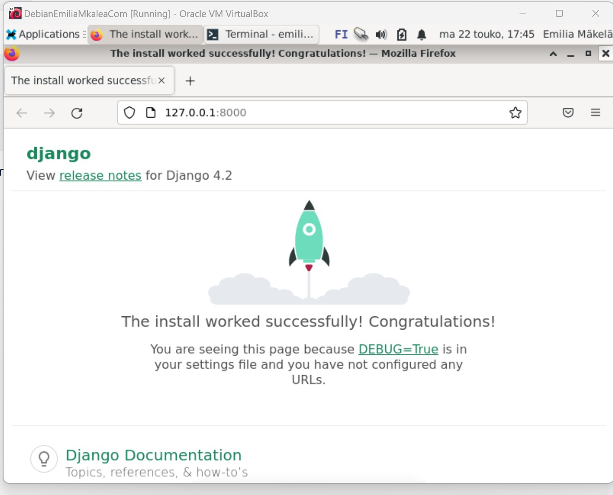
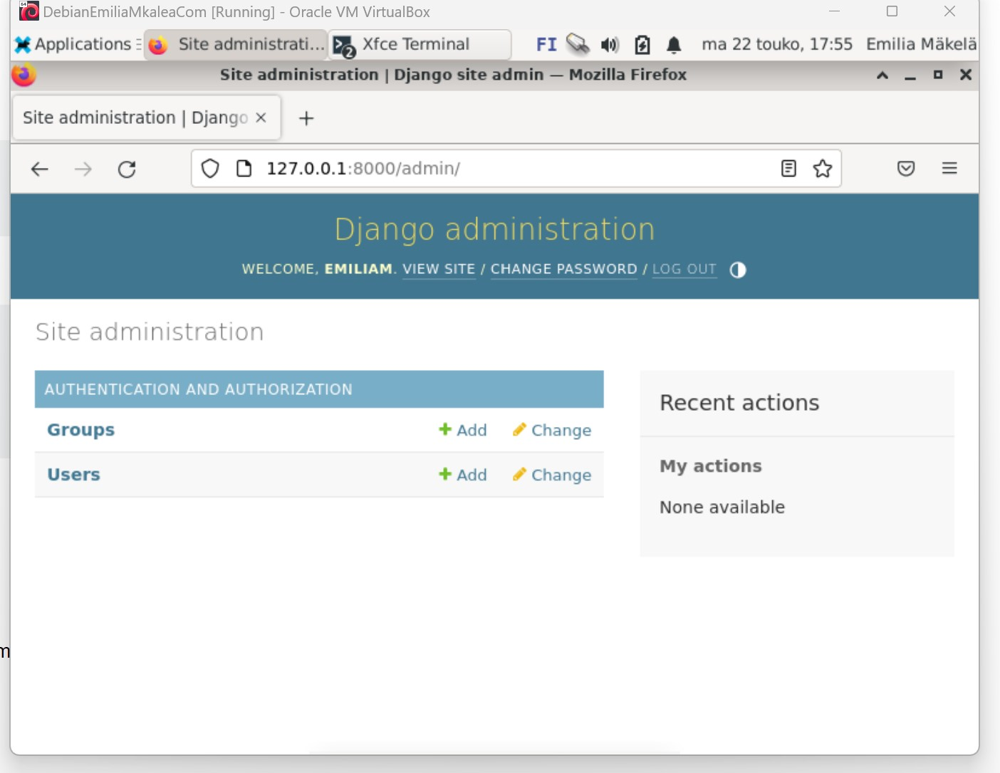
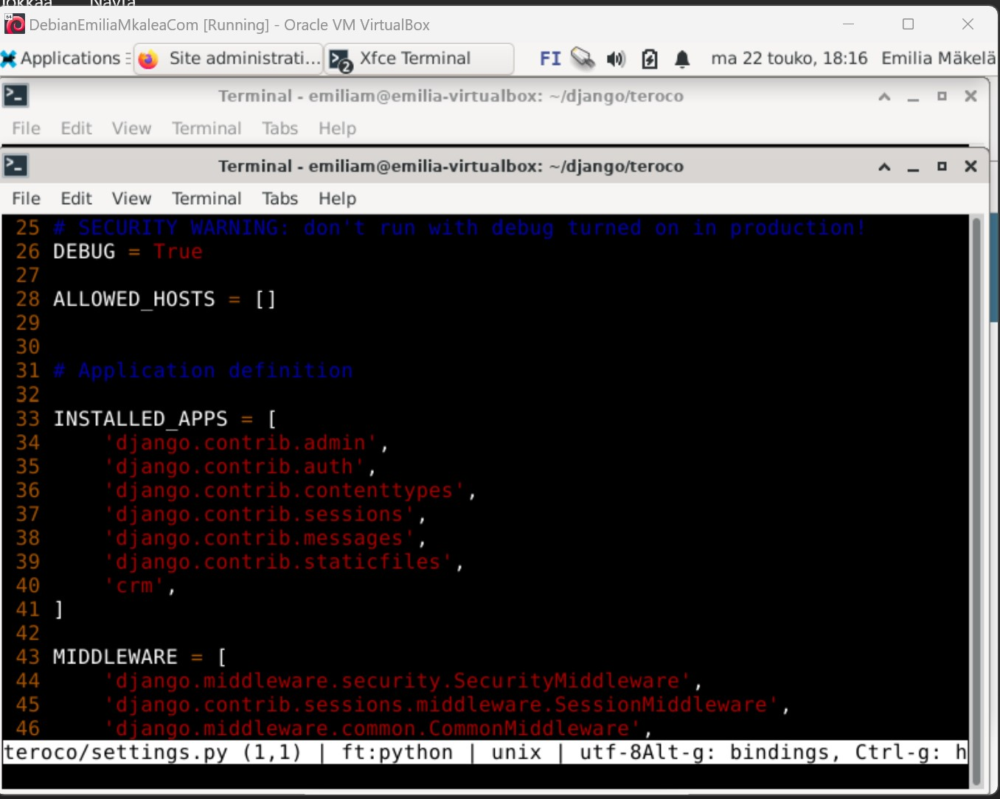
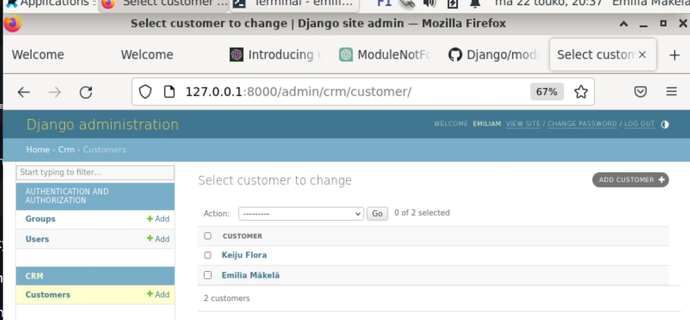

# h1 Läksy

## Ympäristö
Tein harjoituksen 22.05.2023 virtuaalikoneessa Debian 11 käyttöjärjestelmällä

## Djangon Asennus
Djangon asennuksen tein jo aikaisemmin tänään opitunnin aikana olisiko ollut 
klo 12:00 aikaan. Tein ohjeiden mukaan, joten tähän ei mennyt kuin muutama minuutti. 

## Hello DJ Ango<br />

### Klo 19:30 aloitan tekemään kohtaa Hello DJ Ango! <br />

Syöttö: <br />
```
django-admin startproject h1 
```
<br />
Tulos: <br />
Projekti luotiin onnistuneesti <br />
<br />

Siirryin H1 kansioon ja käynnistin serverin: <br />
```
cd h1
./manage.py runserver
```
<br />

Tulos: <br />
Starting development server at http://127.0.0.1:8000/ <br />
Klikkasin linkkiä ja selain käynnistyi automaattisesti <br />

### klo 19:43 Django etusivu näkyy onnistuneesti <br />



### Klo 20:10 Aloitin luomaan Admin käyttäjää ohjeiden avulla <br />

Syötteet ja tulokset: <br />

```
./manage.py makemigrations
```

<br />
Tulos: No Changes <br />

```
./manage.py migrate 
```

<br />
Tulos: No Migrations Apply <br />

```
sudo apt-get install pwgen 
pwgen -s 20 1 # randomize a password # Kopioin salasanan
./manage.py createsuperuser 
```

<br />
Tämän jälkeen lisäsin käyttäjänimen, sähköpostin ja luodun salasanan <br />

<br />
Suunnistin selaimella admin sivulle http://127.0.0.1:8000/admin/ <br />

### klo 20:17 Admin käyttäjä luotu onnistuneesti ja Admin-sivulle pääsi kirjautumaan luodulla käyttäjällä.



## Tietokanta taulun luonti <br />
### Klo 20:20 Yksinkertaisen tietokannan luonti ohjeiden mukaan <br />

Syötteet ja tulokset: <br />
Sovellus luotiin: <br />
```
./manage.py startapp crm 
```
<br /> 

Lisättiin crm ladattuihin sovelluksiin: <br />
```
micro h1/settings.py
```


<br />

Taulu lisätty:<br />
```
micro crm/models.py 
```
<br />

Lisätty tiedostoon seuraava tietokantataulu: <br />
<br />
```
from django.db import models <br />

class Customer(models.Model): <br />
    first_name = models.CharField(max_length=100) <br />
    last_name = models.CharField(max_length=100) <br />
    email = models.EmailField(unique=True) <br />
    phone_number = models.CharField(max_length=20) <br />
    address = models.TextField()
  ```

Tämän jälkeen luotiin migraatiotiedosto ja sovellettiin muutokset: <br />
Syötteet ja tulokset:
<br />

```
./manage.py makemigrations
```
Tulos: <br />
-Create Model Customer <br />
```
./manage.py migrate
```
Tulos: <br />
Applying crm.0001 initial...OK
<br />

Taulu rekistöröitiin adminille <br />
Syötteet: <br />
```
micro crm/admin.py 
```

Admin.py tiedostoon lisättiin tämä:<br />
```
from django.contrib import admin 
from . import models

admin.site.register(models.Customer)
```
<br />

Tarkastettiin näkyykö Customer Admin sivulla selaimessa: <br />
```
./manage.py runserver
```

### Klo 20:52 Customer taulu näkyi Admin-sivulla
### Klo 20:52 Muokattiin tietokantaa lisäämällä kaksi eri asiakasta satunnaisilla tiedoilla 
### Klo 20:55 Kaksi "asiakasta" onnistuneesti lisätty tietokantaan.




